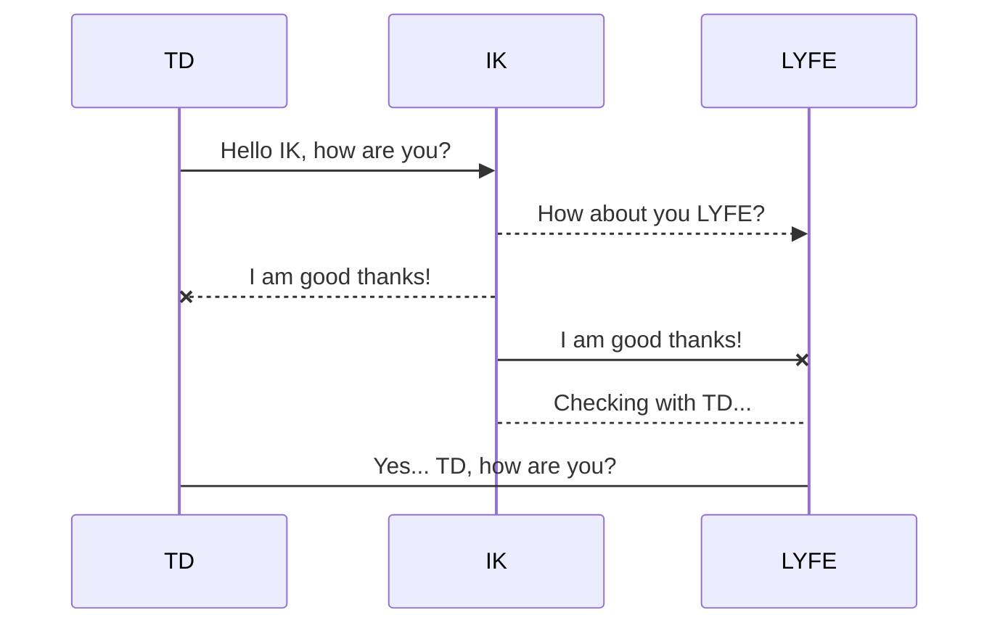

<div class="elevation-3 link d-flex align-stretch v-sheet theme--dark rounded" style="background-color:#242424;border-color:#242424;"><a tabindex="0" href="https://streamer.bot" target="_blank" rel="noopener" class="v-list-item v-list-item--link v-list-item--two-line theme--dark"><div class="v-list-item__action"><span aria-hidden="true" class="v-icon notranslate theme--dark" style="font-size:36px;height:36px;width:36px;"><svg xmlns="http://www.w3.org/2000/svg" viewBox="0 0 24 24" role="img" aria-hidden="true" class="v-icon__svg" style="font-size:36px;height:36px;width:36px;"><path d="M21 2H3a2 2 0 0 0-2 2v16a2 2 0 0 0 2 2h18a2 2 0 0 0 2-2V4a2 2 0 0 0-2-2M11 17.5L9.5 19L5 14.5L9.5 10l1.5 1.5l-3 3l3 3m3.5 1.5L13 17.5l3-3l-3-3l1.5-1.5l4.5 4.5l-4.5 4.5M21 7H3V4h18v3Z"></path></svg></span></div> <div class="v-list-item__content"><div class="v-list-item__title d-flex align-center"><span class="text-h5 font-weight-bold">Streamer.bot</span></div> <!----></div> <div class="v-list-item__action"><span aria-hidden="true" class="v-icon notranslate ml-2 text--secondary theme--dark"><svg xmlns="http://www.w3.org/2000/svg" viewBox="0 0 24 24" role="img" aria-hidden="true" class="v-icon__svg"><path d=""></path></svg></span></div></a></div>

####

<div class="elevation-3 link d-flex align-stretch v-sheet theme--dark rounded" style="background-color:#242424;border-color:#242424;"><a tabindex="0" href="https://wiki.streamer.bot" target="_blank" rel="noopener" class="v-list-item v-list-item--link v-list-item--two-line theme--dark"><div class="v-list-item__action"><span aria-hidden="true" class="v-icon notranslate theme--dark" style="font-size:36px;height:36px;width:36px;"><svg xmlns="http://www.w3.org/2000/svg" viewBox="0 0 24 24" role="img" aria-hidden="true" class="v-icon__svg" style="font-size:36px;height:36px;width:36px;"><path d="M12.081 12.932c-.78 1.611-1.849 3.792-2.379 4.776c-.513.896-.94.776-1.278.024c-1.172-2.77-3.58-7.625-4.712-10.347c-.209-.502-.367-.823-.516-.95c-.151-.125-.462-.2-.936-.227c-.174-.019-.26-.061-.26-.131v-.379l.043-.038c.771-.004 4.503 0 4.503 0l.042.038v.362c0 .1-.063.147-.188.147l-.47.024c-.403.026-.605.137-.605.365c0 .112.044.275.139.501c.902 2.206 4.017 8.772 4.017 8.772l.114.039l2.01-4.012l-.402-.89L9.82 8.285s-.265-.545-.357-.727c-.607-1.203-.593-1.265-1.206-1.347c-.173-.02-.261-.042-.261-.125v-.39l.05-.037h3.578l.095.03v.376c0 .088-.063.125-.189.125l-.257.039c-.66.051-.551.318-.113 1.186l1.319 2.712l1.465-2.922c.244-.533.194-.668.093-.789c-.058-.07-.255-.185-.677-.2l-.168-.018a.191.191 0 0 1-.121-.043a.125.125 0 0 1-.056-.107v-.357l.051-.037c1.04-.007 3.371 0 3.371 0l.05.037v.364c0 .101-.05.148-.161.148c-.539.024-.652.079-.854.366c-.1.154-.313.49-.538.865l-1.919 3.563l-.054.112l2.328 4.763l.142.041l3.665-8.704c.129-.352.107-.602-.053-.746c-.165-.144-.289-.228-.716-.246l-.35-.014a.211.211 0 0 1-.127-.037a.128.128 0 0 1-.06-.1v-.361l.049-.038h4.137l.034.038v.364c0 .1-.062.15-.174.15c-.541.024-.94.15-1.203.351c-.263.213-.465.514-.614.89c0 0-3.371 7.72-4.524 10.289c-.438.84-.878.765-1.253-.026c-.477-.977-1.478-3.156-2.206-4.761l.045-.03z"></path></svg></span></div> <div class="v-list-item__content"><div class="v-list-item__title d-flex align-center"><span class="text-h5 font-weight-bold">Streamer.bot Wiki</span></div> <!----></div> <div class="v-list-item__action"><span aria-hidden="true" class="v-icon notranslate ml-2 text--secondary theme--dark"><svg xmlns="http://www.w3.org/2000/svg" viewBox="0 0 24 24" role="img" aria-hidden="true" class="v-icon__svg"><path d=""></path></svg></span></div></a></div>

####

<div class="elevation-3 link d-flex align-stretch v-sheet theme--dark rounded" style="background-color:#242424;border-color:#242424;"><a tabindex="0" href="https://extensions.streamer.bot" target="_blank" rel="noopener" class="v-list-item v-list-item--link v-list-item--two-line theme--dark"><div class="v-list-item__action"><span aria-hidden="true" class="v-icon notranslate theme--dark" style="font-size:36px;height:36px;width:36px;"><svg xmlns="http://www.w3.org/2000/svg" viewBox="0 0 24 24" role="img" aria-hidden="true" class="v-icon__svg" style="font-size:36px;height:36px;width:36px;"><path d="M19 6V5A2 2 0 0 0 17 3H15A2 2 0 0 0 13 5V6H11V5A2 2 0 0 0 9 3H7A2 2 0 0 0 5 5V6H3V20H13.09A5.47 5.47 0 0 1 13 19A6 6 0 0 1 21 13.34V6M20 15V18H23V20H20V23H18V20H15V18H18V15Z"></path></svg></span></div> <div class="v-list-item__content"><div class="v-list-item__title d-flex align-center"><span class="text-h5 font-weight-bold">Extensions Wiki</span></div> <!----></div> <div class="v-list-item__action"><span aria-hidden="true" class="v-icon notranslate ml-2 text--secondary theme--dark"><svg xmlns="http://www.w3.org/2000/svg" viewBox="0 0 24 24" role="img" aria-hidden="true" class="v-icon__svg"><path d=""></path></svg></span></div></a></div>

####

[](https://discord.streamer.bot)

## DISCORD

## COPY

```html
<span></span>
```

```css
{.changelog-fixes}
```

```css
{.changelog-updates}
```

```css
{.changelog-new}
```



